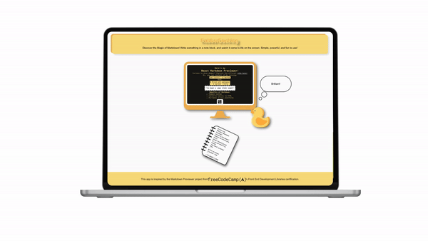

## React Markdown Previewer

Una aplicación interactiva para escribir, visualizar y disfrutar Markdown en tiempo real. Incluye un pato motivador con frases alentadoras. ¡Simple, divertida y poderosa!

## 📱💻 Vista en dispositivos & Animación

### Móvil  

### Laptop  

### Animación

## 🙌 Inspiración

Este proyecto está basado en el desafío [Build a Markdown Previewer](https://www.freecodecamp.org/learn/front-end-development-libraries/front-end-development-libraries-projects/build-a-markdown-previewer) del curso Front End Development Libraries de FreeCodeCamp. Se han agregado características únicas, como un diseño personalizado y un pato motivador, para hacer la experiencia más divertida y única.

## ✨ Características

- **Vista previa de Markdown** en tiempo real.
- Pato motivador que anima al usuario con frases cada 5 segundos.
- Uso de librerías modernas como `marked` para convertir Markdown a HTML.
- Diseño responsivo y divertido.

## 📖 Instalación

1. Clona este repositorio:
   git clone https://github.com/tu-usuario/react-markdown-previewer.git      
   cd react-markdown-previewer
2. Instala las dependencias:
   npm install
3. Inicia la aplicación:
   npm start

## 💻 Cómo usar la app

1. Escribe en el área de texto.
2. Observa cómo el texto se transforma en Markdown en tiempo real.
3. Disfruta las frases motivadoras del pato.

## 🛠️ Tecnologías

- **React**: Biblioteca de JavaScript para construir interfaces de usuario.
- **CSS3**: Para estilizar el diseño, siguiendo la metodología BEM (Block, Element, Modifier) para mantener un código CSS organizado y escalable.
- **Marked**: Para convertir Markdown a HTML.

